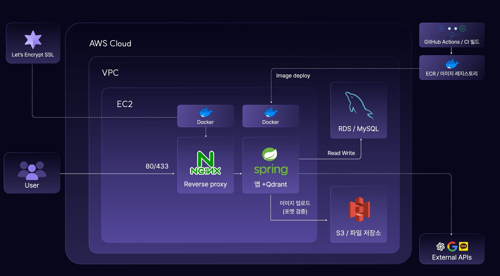

<div align="center">

# 🧑‍🏫 TeachING


### URL 하나로 시작하는 AI 학습 관리 서비스

**블로그·유튜브에서 발견한 학습 자료의 URL을 저장하면 AI가 초보자 눈높이로 분석·요약해 주고,<br/>
저장한 자료를 근거로 답하는 RAG 챗봇과, 자료를 순서대로 엮어 학습을 이끌어주는<br/>
AI 선생님 '티칭맵'으로 학습 완주까지 함께하는 개인 맞춤형 학습 관리 서비스**

<br/>

<a href="https://www.teachingg.site">

</a>

<br/><br/>


</div>

<br/>

## ✨ 주요 기능

<div align="center">
<table>
<tr>
<td width="430" valign="top">

### 📄 자료 관리

- 블로그·유튜브 **URL을 저장**하면 AI가 본문/스크립트를 추출해 **요약·상세 분석** 생성
- 분석 결과는 chunk로 나눠 **Qdrant에 벡터 색인**
- AI 요약/상세 분석은 **직접 수정** 가능
- 폴더 생성·자료 이동·태그·휴지통으로 자료 정리

</td>
<td width="430" valign="top">

### 💬 챗봇 (RAG)

- 채팅방을 만들고 내가 저장한 자료에 대해 **자유롭게 질문**
- 질문을 **벡터 검색**으로 관련 자료를 찾아 근거로 답변 생성
- 관련 자료가 없으면 **일반 지식 기반 fallback** 응답
- 답변에 인용된 **출처 자료** 함께 표시

</td>
</tr>
</table>
</div>

<div align="center">
<table>
<tr>
<td width="430" valign="top">

### 🗺️ 티칭맵

- 폴더 속 자료들을 순서가 있는 **학습 스텝**으로 재구성
- 하이라이트한 부분에 **AI 선생님 해설** 제공
- 말투는 **다정한 / 엄격한 / 응원하는** 페르소나 중 선택
- 스텝 완료 토글로 **진행률** 자동 갱신, 임시저장 지원

</td>
<td width="430" valign="top">

### 🔐 인증 & 멤버십

- **카카오 · 구글** OAuth2 소셜 로그인, JWT 기반 인증
- **카카오페이** 연동 TeachING Plus 구독 결제
- **FREE / PREMIUM** 멤버십 등급 구분
- 마이페이지에서 프로필 · 알림 · AI 선생님 설정 관리

</td>
</tr>
</table>
</div>

<br/>

## 🛠 기술 스택

<div align="center">

**Backend**


**Database**


**AI · 자료 수집**


**결제 · Infra · CI/CD**


**Docs**


</div>

<br/>

## 🏗 아키텍처

<div align="center">



</div>

<br/>

## 🌿 협업 규칙

| 구분 | 내용 |
| --- | --- |
| 🌿 **브랜치** | `type/#이슈번호/설명` (예: `feat/#69/material-url`) → `main` 으로 PR |
| 📝 **커밋** | `Type: 설명` (`Feat` `Fix` `Docs` `Test` `Refactor` `Chore` 등) |
| 🔍 **PR** | GitHub Actions **CI(Gradle 빌드) 통과** 후 머지 |
| 🚀 **배포** | `main` push 시 ECR 이미지 빌드 → EC2 Docker Compose 자동 배포 |

<br/>

## 👥 팀원

<div align="center">
<table>
<tr>
<td align="center" width="172">
<a href="https://github.com/hwiyoon20010309">
<br/>
<b>@hwiyoon20010309</b>
</a><br/>
백엔드<br/>
📄 자료 · URL 분석<br/>
💬 챗봇(RAG)
</td>
<td align="center" width="172">
<a href="https://github.com/Mymyseoyoung">
<br/>
<b>@Mymyseoyoung</b>
</a><br/>
백엔드<br/>
🗺️ 티칭맵<br/>
🔐 인증 · 약관
</td>
<td align="center" width="172">
<a href="https://github.com/m00nsh">
<br/>
<b>@m00nsh</b>
</a><br/>
백엔드<br/>
📄 자료 · 폴더<br/>
🔔 알림 · 홈
</td>
<td align="center" width="172">
<a href="https://github.com/EH-OI">
<br/>
<b>@EH-OI</b>
</a><br/>
백엔드<br/>
🗑️ 휴지통<br/>
💳 결제
</td>
</tr>
</table>
</div>

<br/>

## 📁 저장소 구조

```
backend/
├── src/main/java/com/teaching/backend/
│   ├── domain/     도메인별 패키지 (controller · service · entity · repository · dto)
│   │   ├── auth · user · material · folder · chat
│   │   ├── teachingmap · trash · tag · notification
│   │   └── payment · term · home · support
│   └── global/     공통 설정 (security · config · ai · storage · exception · response)
├── docker-compose.yml   app(Spring Boot) + qdrant 컨테이너 구성
└── .github/workflows/   CI(빌드 검증) · CD(ECR/EC2 배포) 워크플로
```

<br/>

<details>
<summary><h2>📖 도메인별 상세 API 명세 (펼쳐보기)</h2></summary>

### Auth (`/api/v1/auth`)
- `POST /reissue` — AccessToken 재발급
- `POST /signup` — 회원가입(닉네임 확정 · 약관 동의 등록)
- `POST /logout` — 로그아웃
- `GET /check-nickname` — 닉네임 중복 확인
- `GET /oauth2/authorization/{kakao|google}` — 소셜 로그인 진입점

### User (`/users`)
- `GET /me` — 내 정보 조회
- `PATCH /me` — 프로필 수정 (multipart)
- `PATCH /me/notifications` — 알림 설정 변경
- `DELETE /me` — 회원 탈퇴
- `PATCH /me/teacher-persona` — AI 선생님 페르소나 변경

### Material (`/materials`, `/api/v1/materials`)
- `GET /materials` — 자료 목록 조회
- `POST /materials/{materialId}/index` — 자료 색인(Qdrant)
- `POST /api/v1/materials/analyze` — URL 기반 AI 분석 요청
- `PATCH /api/v1/materials/{materialId}/finalize` — 분석 결과 저장 확정

### Folder (`/api/folders`)
- `GET /` · `POST /` — 폴더 목록 조회 · 생성
- `GET /{folderId}` · `PATCH /{folderId}` — 폴더 상세 조회 · 이름 수정
- `GET /{folderId}/materials` — 폴더 내 자료 목록
- `PATCH /{folderId}/trash` · `PATCH /{folderId}/restore` — 폴더 휴지통 이동 · 복구
- `GET/PATCH /{folderId}/materials/{materialId}/analysis(/summary|/detail)` — AI 분석 조회 · 수정
- `GET /{folderId}/materials/{materialId}/tags` — 태그 조회
- `GET /{folderId}/materials/{materialId}/origin-url` — 원본 URL 조회
- `PATCH /{folderId}/materials/move|trash|restore` — 자료 이동 · 휴지통 이동 · 복구

### ChatRoom / ChatMessage (`/chatrooms`)
- `GET /` · `POST /` — 채팅방 목록 조회(커서 페이지네이션) · 생성
- `GET /{chatRoomId}/messages` — 메시지 히스토리 조회(출처 포함)
- `POST /{chatRoomId}/messages` — 질문하기(RAG 기반 답변 생성)

### TeachingMap (`/api/v1/teaching-maps`)
- `GET /` · `POST /` — 티칭맵 목록 조회 · 생성(폴더 기반)
- `GET /{teachingMapId}` · `PATCH /{teachingMapId}` — 단건 조회 · 제목/설명 수정
- `GET /{teachingMapId}/steps/{stepId}` — 스텝 상세 조회
- `PATCH /{teachingMapId}/steps/{stepId}/toggle` — 스텝 완료 토글
- `GET /materials/{materialId}/highlights/{highlightId}/analysis` — 하이라이트 AI 선생님 해설 조회/생성
- `PATCH /trash` — 티칭맵 다중 휴지통 이동
- `POST /temp` — 임시저장

### Trash (`/api/v1/trash`)
- `GET /folders|materials|teaching-maps` — 휴지통 목록 조회
- `GET /folders/{folderId}/materials` — 휴지통 폴더 상세(내부 자료) 조회
- `PATCH /folders|materials|teaching-maps/restore` — 다중 복구

### Notification (`/api/v1/notifications`)
- `GET /` · `GET /summary` — 알림 목록 · 요약 조회
- `PATCH /{notificationId}/read` — 읽음 처리

### Payment (`/api/v1/payments`)
- `POST /ready` — 구독 결제 준비(카카오페이)
- `GET /success|cancel|fail` — 결제 결과 콜백

### Term (`/api/v1/terms`)
- `GET /` — 약관 목록 조회

### Home (`/api/v1/home`)
- `GET /` — 홈 대시보드 조회

</details>

<br/>

<div align="center">

**🧑‍🏫 TeachING** · Made with care by the TeachING-Dev team

<sub>2026. 08. 13. ver.</sub>

</div>
